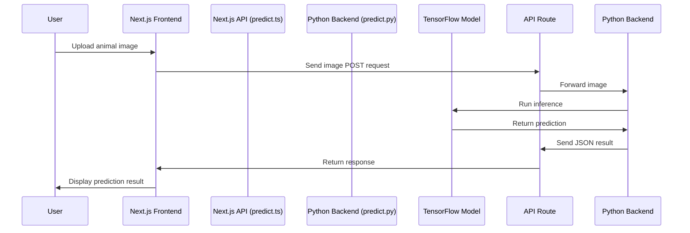

# 🐾 Animal Recognizer

A full-stack AI-powered web application for identifying animals from uploaded images using a custom-trained deep learning model.

---

## 📌 Overview

**Animal Recognizer** is a Next.js + Python-based web app that allows users to upload images of animals and get real-time predictions.

It uses a **TensorFlow/Keras deep learning model** for animal recognition and integrates with a **Next.js (TypeScript) frontend** for a responsive user experience.

---

## 🚀 Features

- ✅ Upload animal images from the browser  
- ✅ Real-time predictions from a machine learning model  
- ✅ Clean, responsive UI built with **Next.js**, **TypeScript**, and **Tailwind CSS**  
- ✅ Backend inference powered by **Python** and **TensorFlow**

---

## 🧰 Tech Stack

| Layer      | Technology                 |
|----------- |----------------------------|
| Frontend   | Next.js (TypeScript), Tailwind CSS |
| Backend    | Python (TensorFlow, Pillow, NumPy) |
| AI Model   | TensorFlow/Keras (`animal_model.h5`) |
| API Layer  | Next.js API routes (TypeScript → Python) |

---

## 🏗️ Project Structure
```bash
animal-recognizer/
├── src/
│ ├── components/
│ │ └── Predictor.tsx # Frontend UI component for image upload and results
│ ├── models/
│ │ └── animal_model.h5 # Trained TensorFlow/Keras animal classification model
│ ├── pages/
│ │ ├── api/
│ │ │ └── predict.ts # Next.js API route - forwards request to Python backend
│ │ ├── _app.tsx # Global Next.js app setup
│ │ └── index.tsx # Main frontend page
│ ├── styles/
│ │ └── globals.css # Tailwind and global CSS styling
│ └── util/
│ └── labels.json # Class labels for prediction mapping
├── server/
│ └── predict.py # Python backend for model inference
├── requirements.txt # Python dependencies
└── README.md # This file
```

---

## 🖥️ Getting Started (Local Development)

### ✅ Prerequisites

- Node.js (v14 or higher)
- Python (v3.8 or higher)
- npm or yarn
- pip (Python package manager)

---

### 🔨 Installation Steps

1. **Clone the Repository**
   ```bash
   git clone https://github.com/it23782518/animal-recognizer.git
   cd animal-recognizer
   ```

2. **Install Frontend Dependencies**
   ```bash
   npm install
   # or
   yarn install
   ```

3. **Install Python Backend Dependencies**
   ```bash
   pip install -r requirements.txt
   ```

4. **Run Next.js Development Server**
   ```bash
   npm run dev
   # or
   yarn dev
   ```

5. **Open App in Browser**
   ```
   http://localhost:3000
   ```

---

## 🧠 AI Model Training Summary

The animal classification model (`animal_model.h5`) used in this project was **trained on Google Colab** using TensorFlow/Keras.

### 📍 Google Colab Training Notebook:

[Colab Training Link](https://colab.research.google.com/drive/1Lxqs1Xpi1tqzfvkwWuF34jLmgaItbC2m?usp=sharing)

### 📋 Training Details:

- **Framework**: TensorFlow / Keras  
- **Dataset**: Custom animal image dataset (classification into multiple animal categories)  
- **Model Type**: CNN (Convolutional Neural Network)  
- **Exported Model Format**: HDF5 (`animal_model.h5`)  
- **Labels File**: Class label mapping saved in `src/util/labels.json`

---

## ✅ Prediction Flow



## ✅ Future Improvements

- ✅ Deploy model on cloud storage and load dynamically
- ✅ Convert model to TensorFlow.js for frontend-only inference
- ✅ Add confidence score visualization
- ✅ Add drag-and-drop upload support
- ✅ Implement image compression before upload
- ✅ Add unit tests for backend and frontend components

---

## 👨‍💻 Author

**Dilusha Chamika**  
GitHub: [https://github.com/it23782518](https://github.com/it23782518)

> 🦾 AI model trained and integrated by Dilusha Chamika
